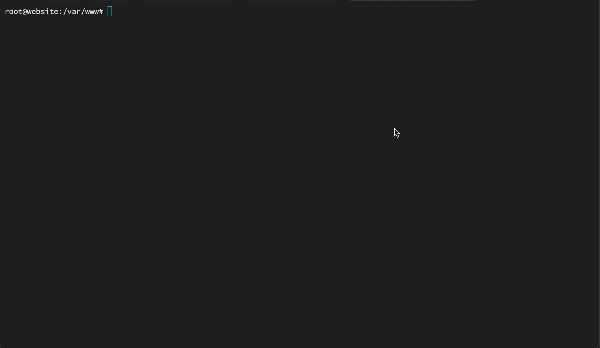

# 🚀 laravel-deploy.sh



Easily automate your **Laravel** deployments with this flexible shell script. Designed for seamless **Continuous Deployment (CD)** on Linux servers.

| Feature               | Status |Description |
|-------------------------|--|--------------------------------------------------------------|
| **OS Detection**        | ✅|Auto-detects Debian, RHEL, or allows manual selection.        |
| **Backup System**       | ✅|Automatically backs up code & database before deploying.     |
| **Scheduler Check**     | ✅|Ensures the Laravel cron job is installed and running.       |
| **Storage & Permissions** | ✅|Sets up Laravel storage directories and fixes permissions.  |
| **Cache Optimization**  | ✅|Clears and optimizes views, config, routes, etc.             |
| **Database Migrations** | ✅|Runs migrations & seeding (can be skipped).                  |
| **Queue Management**    | ✅|Restarts Supervisor & queue workers after deployment.        |
| **Maintenance Mode**    | ✅|Enables during deployment and disables after (optional).     |
| **SELinux Handling**    | ✅|Configures correct file permissions automatically.           |
| **Dependency Installation** | ✅|Installs new Composer packages when needed.              |
| **Deployment Summary**  |✅ |Displays a detailed status report post-deployment.          |


## 🖥️ Supported Linux Distributions

This script works with all major Linux distributions:

```text
✅ Ubuntu
✅ Debian
✅ Rocky Linux
✅ AlmaLinux
✅ CentOS
✅ RHEL
```


## 🚀 Getting Started

### 📥 1️⃣ Clone This Repository
```bash
git clone https://github.com/omar-haris/laravel-deploy.git
cd laravel-deploy
```

### 🔑 2️⃣ Make the Script Executable
```bash
chmod +x laravel-deploy.sh
```

### ▶️ 3️⃣ Run the Script
```bash
./laravel-deploy.sh -h
```
💡 **Tip:** Run `-h` to see all available options.


## 🛠️ Deployment Options

### 🌍 **Update an Existing Project**
```bash
./laravel-deploy.sh \
  --project-dir=/var/www/laravel \
  --branch=main
```

### 🆕 **Deploy a New Project from Git**
```bash
./laravel-deploy.sh \
  --git-url=https://github.com/your/repo.git \
  --env-file=your-laravel-project-env-file.env \
  --project-dir=/var/www/laravel \
  --branch=main
```

### 🐛 **Debug Mode**
```bash
# Mask sensitive information (default)
./laravel-deploy.sh --debug

# Show actual credentials (use with caution!)
./laravel-deploy.sh --debug --unsecure
```


## ⚙️ Available Options

| Option                   | Default Value                   | Description                                         |
|--------------------------|--------------------------------|-----------------------------------------------------|
| `--project-dir=PATH`     | `/var/www/laravel`            | Set the directory where the Laravel application is deployed. Use an absolute path. |
| `--deploy-script=PATH`   | `/var/www/larave-deploy.sh`   | Path to the deployment script. Typically, this is the script being executed. |
| `--os-type=[auto|debian|rhel]` | `auto`                | Automatically detect OS type or force it to `debian` or `rhel` (Red Hat-based systems). |
| `--web-user=USER`        | `www-data`                    | Specify the web server user. Use `apache` for RHEL-based systems and `www-data` for Debian-based systems. |
| `--branch=BRANCH`        | `main`                        | Define the Git branch to deploy. Use this to switch between different code versions. |
| `--backup-dir=PATH`      | `/var/backups/laravel`        | Set the directory where backups will be stored. Provide an absolute path. |
| `--keep-backups=NUMBER`  | `7`                           | Specify the number of old backups to keep before deleting older ones. |
| `--git-url=URL`          | `""`                          | Provide a Git repository URL for cloning if the project directory is empty. |
| `--env-file=PATH`        | `""`                          | Path to the `.env` file. **Required** when using `--git-url` for fresh clones. |
| `--php-bin=PATH`         | `/usr/bin/php`                | Set the PHP binary path. Use `which php` to find the correct path. |
| `--composer-bin=PATH`    | `/usr/local/bin/composer`     | Path to the Composer binary. Useful if Composer is installed in a non-standard location. |
| `--no-backup`            | `false`                       | Use this flag to skip creating code and database backups before deployment. |
| `--no-maintenance`       | `false`                       | Skip enabling maintenance mode during deployment. Normally, maintenance mode prevents users from seeing broken pages while updates are applied. |
| `--no-migrate`           | `false`                       | Skip running Laravel database migrations. Use this if you are sure no migrations are needed. |
| `--no-cache-clear`       | `false`                       | Skip clearing and optimizing Laravel caches. Useful for quick deployments where caching is needed. |
| `--no-permissions`       | `false`                       | Skip setting file and folder permissions. Use this if you manually set permissions. |
| `--no-supervisor`        | `false`                       | Skip restarting Supervisor after deployment. Use this if Supervisor is not used or managed manually. |
| `--no-storage-link`      | `false`                       | Skip creating a symbolic link for `storage`. Laravel needs this link for file uploads and logs. |
| `--check-cron`           | `true`                        | Check if Laravel’s cron job (`schedule:run`) is set up. Helps ensure scheduled tasks run automatically. |
| `--check-chcon`          | `true`                        | Apply SELinux security contexts for Laravel if needed. Relevant for RHEL-based systems with SELinux enabled. |
| `--debug`                | `false`                       | Enable debug mode to print executed commands (hides sensitive data like passwords by default). |
| `--unsecure`             | `false`                       | Used with `--debug` to reveal sensitive data (like DB passwords). **Not recommended for production!** |
| `-h, --help`             | `false`                       | Display help information and exit. Run `./laravel-deploy.sh --help` to see usage details. |


## 📊 Deployment Summary Output

After deployment, a summary like this will be displayed:

```bash
--------------------------------------------------------
Deployment Summary:
--------------------------------------------------------
  DEBUG_MODE          : false
  UNSECURE_MODE       : false
  OS_TYPE             : auto
  WEB_USER            : www-data
  PROJECT_DIR         : /var/www/laravel
  GIT_URL             : '(none)'
  ENV_FILE_PATH       : '(none)'
  BRANCH              : main
  Last Commit ID      : cc316d6
  Last Commit Msg     : Added images
  Code Backup         : /var/backups/laravel/20250220_050124/code.tar.gz
  DB Backup           : /var/backups/laravel/20250220_050124/db.sql.gz
  PHP Version         : PHP 8.1.31
  DB Version          : MySQL/MariaDB: 8.0.41-0ubuntu0.24.04.1
  Disk Usage          : 4.4G / 75G (Free: 68G) on /
  ENABLE_BACKUP       : true
  ENABLE_MAINTENANCE  : true
  RUN_MIGRATIONS      : true
  CLEAR_CACHE         : true
  SET_PERMISSIONS     : true
  RESTART_SUPERVISOR  : true
  CHECK_CRON          : true
  CHECK_CHCON         : true
  CREATE_STORAGE_LINK : true
--------------------------------------------------------
```


## 📜 License

This project is licensed under the **MIT License**.

```text
The MIT License (MIT)
=====================

Copyright © `2025` `Omar Haris`

Permission is hereby granted, free of charge, to any person
obtaining a copy of this software and associated documentation
files (the “Software”), to deal in the Software without
restriction, including without limitation the rights to use,
copy, modify, merge, publish, distribute, sublicense, and/or sell
copies of the Software, and to permit persons to whom the
Software is furnished to do so, subject to the following
conditions:

The above copyright notice and this permission notice shall be
included in all copies or substantial portions of the Software.

THE SOFTWARE IS PROVIDED “AS IS”, WITHOUT WARRANTY OF ANY KIND,
EXPRESS OR IMPLIED, INCLUDING BUT NOT LIMITED TO THE WARRANTIES
OF MERCHANTABILITY, FITNESS FOR A PARTICULAR PURPOSE AND
NONINFRINGEMENT. IN NO EVENT SHALL THE AUTHORS OR COPYRIGHT
HOLDERS BE LIABLE FOR ANY CLAIM, DAMAGES OR OTHER LIABILITY,
WHETHER IN AN ACTION OF CONTRACT, TORT OR OTHERWISE, ARISING
FROM, OUT OF OR IN CONNECTION WITH THE SOFTWARE OR THE USE OR
OTHER DEALINGS IN THE SOFTWARE.
```
